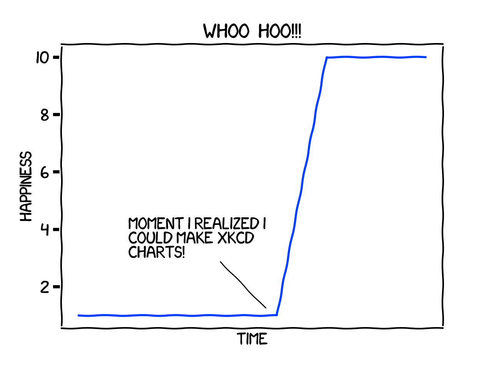

##Purpose
Queries a sqlite db and plots returned values in XKCD style using matplotlib

usage: dbgraph.py

###Sample Output

###Additional Reading for XKCD Graphs

*   [http://matplotlib.org/xkcd/examples/showcase/xkcd.html](http://matplotlib.org/xkcd/examples/showcase/xkcd.html)
*   [http://matplotlib.org/users/annotations_intro.html](http://matplotlib.org/users/annotations_intro.html)
*   [http://jakevdp.github.io/blog/2013/07/10/XKCD-plots-in-matplotlib/](http://jakevdp.github.io/blog/2013/07/10/XKCD-plots-in-matplotlib/)